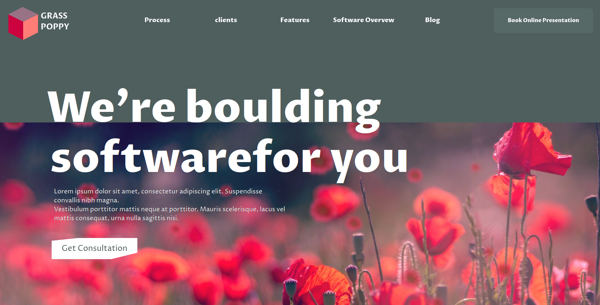
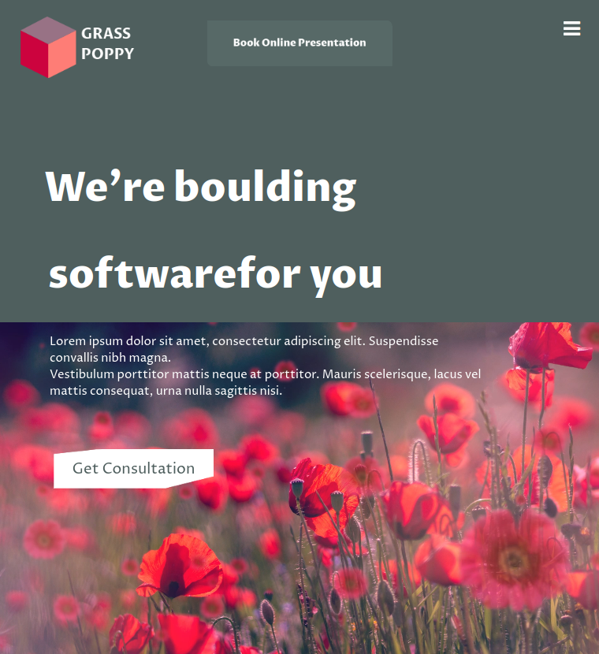

# Page-Animate

# Lien vers le projet :
 https://magaligarot.github.io/Page-Animate/

# Le projet :
Réalisation d'une page wev d'après un wireframe existant réalisé par [Ruslan Bakhar](https://dribbble.com/ruslanbakhar). Le but étant de reproduire au maximum le concept, tout en essayant de trouver les ressources externes sur le web (images, font, etc). 

## Liens vers l'exercice
[Becode](https://github.com/becodeorg/LIE-Hamilton-4.25/blob/master/01-main-course/02-the-hills/03-dribbble-challenges.md)

[Wireframe](https://dribbble.com/shots/14802362-Corporate-Website-for-ERP-Software-company)

## Langages 
* HTML
* SCSS
* CSS

## Structure du projet
* index.html
* style.scss
* style.css

## Responsive
* Smartphone
* Tablette

## A propos :

### Magali :
Actuellement en formation à BeCode Liège, je me forme avec comme objectif de décrocher un emploi dans le web développement. 
